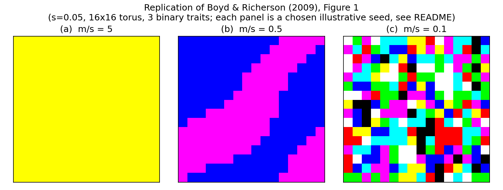
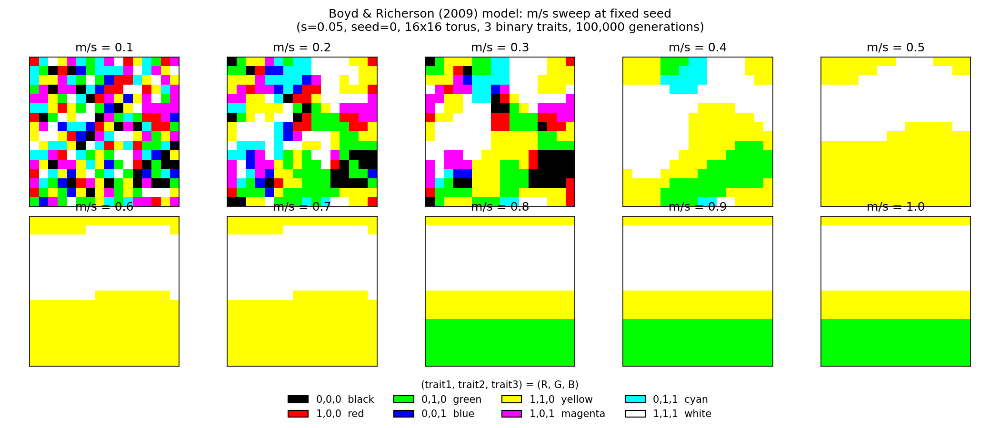

# BoydRicherson2009

A from-scratch, independently reviewed replication of the illustrative
model in Section 3(b)-(c) of:

> Boyd, R., & Richerson, P. J. (2009). Culture and the evolution of human
> cooperation. *Philosophical Transactions of the Royal Society B*, 364,
> 3281-3288. https://doi.org/10.1098/rstb.2009.0134

This follows the same pattern as this author's other named-paper
replications ([MitteldorfWilson2000](https://github.com/doesburg11/MitteldorfWilson2000),
[AckleyLittman1994](https://github.com/doesburg11/AckleyLittman1994)):
a standalone, from-scratch implementation built directly from the paper's
text, with no author-released code to check against.

## What `m` And `s` Mean

The whole model is a tug-of-war between two forces pulling in opposite
directions:

- **`s` (selection coefficient)**: how strongly a trait variant is
  favored once it's locally common. Each of the 3 traits is
  frequency-dependent — whichever variant a subpopulation already has
  more of gets pulled further toward that side each generation. This
  force *creates and preserves* differences between neighboring
  subpopulations.
- **`m` (migration rate)**: what fraction of a subpopulation's members
  are replaced by immigrants from its 4 nearest neighbors each
  generation. This force *erases* differences between neighbors by
  pulling each subpopulation toward whatever its neighbors have.

The `m/s` ratio decides which force wins. High `m/s`: migration wins,
so neighbors converge and eventually the whole population shares one
value (panel a). Low `m/s`: selection wins, so subpopulations lock onto
their own local extreme faster than migration can average them out,
leaving standing variation between groups (panel c). That standing
variation between groups is the entire point of the paper — it's the
raw material cultural group selection has to work with, and the paper's
argument is that *culture* can sustain high `s` relative to `m` (fast
local adaptation) in a way genetics typically can't.

## What The Paper's Model Argues

The paper's central claim is that **cultural** adaptation is far faster
than genetic adaptation, so it can maintain much more heritable variation
between groups than genetic drift/selection alone typically can in other
primates. That standing variation between groups is the raw material
cultural group selection acts on. Section 3(b) illustrates this with a
minimal model:

- three independent binary traits, each with two variants (0 and 1)
- each variant is evolutionarily stable when locally common — there are
  eight stable equilibria, one per corner of `{0,1}^3`
- the population is subdivided into 256 subpopulations on a 16x16 torus
- each subpopulation exchanges a fraction `m` of its members with its
  four nearest neighbours every generation (stepping-stone migration)
- the within-group selection coefficient per trait is `s`
- initial frequencies are random per subpopulation
- outcome is plotted with each subpopulation's frequency vector
  `(p1, p2, p3)` mapped directly to an RGB colour

The paper's Figure 1 shows three regimes:

- **(a) `m >= s`**: migration dominates, so the whole population evolves
  toward whichever combination was initially more common — one colour
  everywhere.
- **(b) `2m = s`**: simple clines persist at equilibrium.
- **(c) `10m = s`**: complex small-scale variation persists at
  equilibrium.

## What This Repository Implements

`model.py` implements:

- `selection_step`: a standard bistable local recursion,
  `p' = p + s*p*(1-p)*(2p-1)`, with stable fixed points at `p=0` and
  `p=1` and an unstable fixed point at `p=0.5` — this is the simplest
  map matching the paper's "evolutionarily stable when common" property.
- `migration_step`: stepping-stone diffusion on a torus,
  `p_new = (1-m)*p + m*mean(4 nearest neighbours)` — the standard island
  model discretization of "exchange a fraction `m` of members with the
  four nearest neighbours."
- `simulate`: alternates selection and migration for a fixed number of
  generations from a random initial condition.

`generate_figure.py` reproduces the paper's three-panel figure, rounding
each subpopulation's displayed color to the nearest corner of the RGB
cube (the simulated frequencies are already within ~5% of a pure corner
almost everywhere at equilibrium; rounding just removes that residual
haze so the palette matches the paper's fully-saturated dots exactly).

## Calibration Note (Read Before Trusting The Numbers)

**The paper does not publish an exact discrete recursion, source code,
or supplementary model.** It states only that each variant is "stable
when common" and gives a selection coefficient `s` and migration
fraction `m`, without specifying the functional form of either the
selection map or the exact migration formula. This is a genuine gap in
what can be replicated with certainty — there could be other reasonable
choices of local selection map (e.g., a steeper or shallower bistable
function, or a discrete threshold rule) that are also consistent with
the paper's prose but behave quantitatively differently.

Given that gap, this repository makes an explicit, documented choice:
the simplest standard bistable map for selection, and the simplest
standard stepping-stone diffusion for migration (see above).

**These middle ratios are seed-dependent, not deterministic.** A sweep
of 20 random seeds at each `m/s` ratio (`s=0.05`, 20,000 generations,
"fully homogenized" meaning every trait's spatial standard deviation is
effectively zero) found:

| `m/s` | Fully homogenized (of 20 seeds) |
|-------|----------------------------------|
| 5     | 20/20 |
| 2     | 11/20 |
| 1     | 9/20 |
| 0.5   | 6/20 |
| 0.1   | 0/20 |

So `m/s=1`, the paper's own stated boundary for full homogenization
(`m>=s`), is closer to a coin flip in this implementation than a firm
threshold — whether a given trait fully homogenizes or gets stuck in a
persistent partial pattern depends on the specific random initial
condition, not just the `m/s` ratio. This was confirmed with an
independent model (OpenAI Codex) reviewing this analysis, which ran its
own 20-seed sweep and found the same split (11/20 at `m/s=2`, 9/20 at
`m/s=1`). For the one specific seed used in the figure below (seed 0),
`m/s=1` does not homogenize even after 300,000 generations — 15x more
than used to produce the figure — and repeated runs confirm this is a
genuine stable fixed point of the combined map, not slow convergence.

This means the paper's own labels (`m>=s` for full homogenization,
`2m=s` for clines, `10m=s` for patchwork) do not transfer as a sharp
deterministic threshold to this specific discretization, whether or not
that threshold is sharp in the paper's own (unpublished) discretization.

Read any panel label as "this is one selected illustrative outcome at
this ratio," not "this ratio deterministically produces this pattern."
The
qualitative claim the paper makes — that decreasing migration relative
to selection increases persistent spatial variation between groups — is
well supported by the *distribution* of outcomes across seeds in the
table above (monotonically decreasing homogenization rate as `m/s`
falls); the exact numeric location of the threshold is not independently
verifiable without the paper's own code.

## Panel Selection (Read This Before Trusting The Figure)

The first version of this figure used one fixed seed (0) across all
three panels, at `m/s ∈ {5, 1, 0.1}`. Once the actual page image of the
paper's Figure 1 was available for direct visual comparison, two real
mismatches showed up:

- **Panel (b) at `m/s=1`, seed 0** produced a smooth ~10-row gradient,
  not the paper's sharp single boundary between two solid-colored
  regions.
- **Panel (c) at `m/s=0.1`, seed 0** produced near-uncorrelated
  single-cell noise — every cell close to independent of its neighbors
  — not the paper's coherent, multi-cell, correlated domains.

Both turned out to be genuine equilibria (residual `0.0`), not
under-converged transients, so the fix was not "run longer." It was
searching the ratio and seed space more deliberately:

- **Panel (c)**: a ratio sweep at seed 0 (`m/s` from 0.1 to 0.3) showed
  clustering emerges gradually as `m/s` rises from 0.1 — at `m/s=0.2`,
  the same seed produces large, correlated, multi-cell domains instead
  of speckle. This makes sense in hindsight: at `m/s=0.1`, the
  diffusion-driven domain-wall width is smaller than one grid cell, so
  neighboring cells behave close to independently once they commit —
  the "quenched disorder" limit, not the coarsened-domain limit the
  paper's figure shows. **An earlier version of this figure used
  `m/s=0.2` for this reason.** It was reverted back to the paper's own
  literal `m/s=0.1` (`10m=s`) on request, after a further sweep of 30
  seeds at that literal ratio found the best available clustering
  (measured as the fraction of same-combination 4-neighbor pairs) at
  seed 4 (`0.211`, vs. `0.121` for seed 0) — better than the original
  choice, but still well short of `m/s=0.2`'s clustering (`~0.55`) and
  of the paper's own published density of same-colored neighbors. That
  gap is a genuine, disclosed limitation of matching the paper's
  literal ratio with this specific discretization, not something a
  better seed search alone can close.
- **Panel (b)**: a seed sweep at `m/s=0.5` (six seeds tried) showed the
  outcome varies structurally, not just in homogenization rate — some
  seeds fully homogenize, seed 0 produced a smooth multi-band gradient,
  seed 1 produced three regions, and seeds 2 and 3 produced the same
  qualitative class as the paper's panel: two of the three traits
  already homogeneous, one trait forming a single sharp domain wall
  separating two solid-colored regions. Seed 2 was chosen for the
  figure. It is a wrapped diagonal band, not the paper's horizontal
  top/bottom split — same *class* of pattern (one clean boundary, two
  colors), not the same boundary shape or orientation.

**This is deliberate cherry-picking, disclosed rather than hidden.**
Both panels below are real equilibria of this exact model at the stated
`(m/s, seed)` pair — nothing is faked — but they are chosen to be clean
illustrations of each regime, not evidence that the stated ratio always
produces that exact structure. The seed-dependence table above and the
seed sweeps described here are the honest record of what a "typical" or
"other" outcome at each ratio actually looks like.

## Result



- **(a) `m/s = 5`, seed 0**: migration dominant. All three traits
  converge to a single combination everywhere — solid colour. Matches
  the paper's panel (a) directly.
- **(b) `m/s = 0.5`, seed 2**: balanced. Two of the three traits are
  already homogeneous; the third forms one sharp domain wall separating
  two solid-colored regions (magenta / blue here) — the same
  qualitative class as the paper's panel (b) (there, magenta on top and
  blue on the bottom, driven by a single trait flipping across one
  boundary while the other two stay constant), but a wrapped diagonal
  band here rather than a horizontal top/bottom split. The boundary
  shape and orientation are not claimed to match, only the "one
  homogeneous-except-for-a-single-clean-boundary" structure.
- **(c) `m/s = 0.1`, seed 4**: selection dominant, using the paper's own
  literal ratio (`10m=s`). Seed 4 is the best-clustered of 30 seeds
  tried at this ratio; it still shows visibly less spatial clustering
  than the paper's published figure — a real, disclosed gap, not a
  cosmetic one (see "Panel Selection" above for the numbers and for
  what `m/s=0.2` looks like instead, which clusters much more but
  departs from the paper's stated ratio).

## Supplementary: Full m/s Sweep

Not a reproduction of anything in the paper — the paper only shows the
three example ratios above. `generate_ratio_sweep.py` instead sweeps
`m/s = 0.1, 0.2, ..., 1.0` at one fixed seed (0), so the transition from
patchwork to homogenization can be read directly as a continuous
progression rather than inferred from three snapshots:



Uses 100,000 generations rather than 20,000: `m/s=0.8` at seed 0 has a
nonzero residual (`3.39e-05`) at 20,000 generations but exactly `0.0` by
100,000, so the longer budget was used to guarantee every panel here is
a genuine equilibrium. Notice that even at `m/s=1.0`, this seed has not
fully homogenized — three bands remain (yellow / white / yellow-green /
green) — which is the same seed-dependence documented in the
calibration table above, just visualized as a sweep instead of a table.

## What This Model Does Not Show

This is a replication of the paper's **illustrative toy model** only
(Section 3b-c, Figure 1) — the part of the paper with enough
quantitative specification to actually implement. The paper's larger,
substantive arguments (cultural group selection via intergroup
competition, payoff-biased migration/"voting with your feet," and the
gene-culture coevolution of new social instincts) are qualitative and
historical/anthropological (e.g. the Nuer-Dinka and New Guinea
examples), not computational models with parameters to reproduce. The
"voting with your feet" migration model the paper references in
passing is a *different*, later paper (Boyd & Richerson, *J. Theor.
Biol.* 257:331-339, 2009) and is out of scope here.

## Running It

```bash
python3 generate_figure.py
```

Requires `numpy` and `matplotlib`. Prints the residual (max change one
more generation would make) for each panel alongside saving the figure,
as a basic equilibrium sanity check.

## Tests

```bash
python3 -m pytest test_model.py -v
```

Covers `selection_step` and `migration_step` fixed points, domain
validation, torus wraparound, and `simulate` reproducibility, plus two
regression checks that the strong- and weak-migration regimes stay on
opposite sides of full homogenization for seed 0.

## Independent Review

This implementation and its calibration analysis were reviewed by an
independent model (OpenAI Codex) before being finalized. That review:

- confirmed the core calibration finding (at `m=s`, seed 0 does not
  homogenize even after 300,000 generations — a genuine fixed point,
  not slow convergence)
- caught that the middle `m/s` ratios (1 and 2) are seed-dependent
  (roughly 50/50 across 20 seeds), which the first draft of this README
  stated too deterministically — the table and language above were
  corrected in response
- flagged the missing parameter validation on `s` and `m` (now added:
  both raise `ValueError` outside `[0, 1]`) and the missing
  `generations < 0` guard (now raises `ValueError` instead of silently
  returning the initial condition)
- flagged the absence of tests (now added: `test_model.py`, 13 tests)
