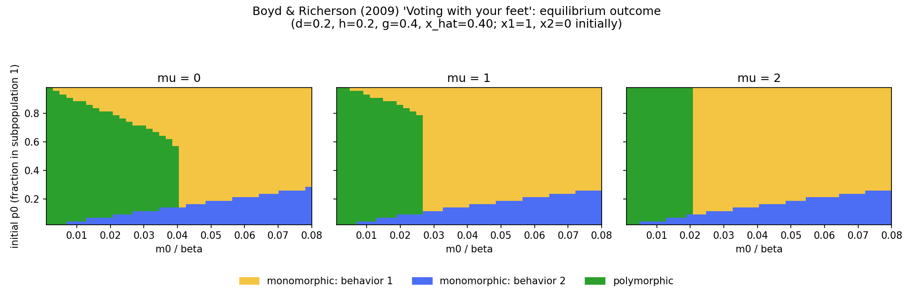

# Voting With Your Feet

A from-scratch, independently reviewed replication of:

> Boyd, R., & Richerson, P. J. (2009). Voting with your feet: payoff
> biased migration and the evolution of group beneficial behavior.
> *Journal of Theoretical Biology*, 257(2), 331-339.
> https://doi.org/10.1016/j.jtbi.2008.12.007

This is the companion paper to the one replicated in
[culture_human_cooperation/](../culture_human_cooperation) — same
authors, same year, but a distinct model and question, hence its own
subfolder rather than being folded into that one.

## What The Paper's Model Argues

Human migration is nonrandom: people tend to move from societies they
perceive as worse to ones they perceive as better. If migrants
*assimilate* to their new society's norms (rather than converting it to
theirs), this "voting with your feet" can spread whichever cultural
norm makes a society attractive — without requiring any group-level
conflict, conquest, or differential extinction. The paper's question is
when this actually works: does the group-beneficial norm always win, or
can migration instead just entrench whichever norm happened to start
out more common?

## The Model

Two subpopulations (1 and 2). Each carries a frequency `x_i` of
"behavior 1" (the alternative is "behavior 2"). Within each
subpopulation:

- Behavior 1's payoff: `W1(x) = 1 - h + x*(d + g + h)`
- Behavior 2's payoff: `W2(x) = 1 + d - x*d`

This is a coordination game: behavior 1 is favored when common
(`W1(1) > W2(1)`), behavior 2 is favored when common (`W1(0) < W2(0)`),
and there's a single unstable equilibrium `x_hat` separating the two
basins of attraction. Behavior 1 is the "group beneficial" one — it
gives a strictly higher average payoff when common — but if `h > g`, it
has the *smaller* basin of attraction, so being group-beneficial and
being easy to reach from a random start are two different things.

Each generation:

1. **Within-group imitation**: individuals in each subpopulation
   observe a random subpopulation-mate and switch behavior with
   probability proportional to the payoff difference.
2. **Payoff-biased migration**: a base fraction `m0` of each
   subpopulation migrates to the other, but that fraction is biased
   upward toward whichever subpopulation currently has the higher
   average payoff, by a bias strength `mu` ("voting with your feet").

The central question the paper asks: does this process reliably spread
the group-beneficial behavior, or does the outcome depend on where each
subpopulation started and how big it was?

## What This Repository Implements

`model.py` implements the paper's equations 1-7 directly: `payoffs`
(eq. 1), `x_hat` (eq. 2, corrected — see below), `within_group_update`
(eq. 3/4), `migration_rate` (eq. 7), and `step`/`simulate` (eq. 5/6,
corrected — see below).

`generate_figure.py` reproduces the structure of the paper's Figs. 6-7:
for a grid of (initial `p0`, `m0/beta`), it classifies which of the
three stable outcomes the system reaches from `x1=1, x2=0` —
monomorphic at behavior 1, monomorphic at behavior 2, or polymorphic —
across three panels for `mu = 0, 1, 2`.

## Two OCR Corrections (Read Before Trusting The Equations)

The paper was provided as an OCR'd PDF. Two of its transcribed
equations were algebraically inconsistent with equation (1), and were
corrected here after independent verification (confirmed a second time
by an independent model — OpenAI Codex — which located the
author-hosted PDF and re-derived both from scratch):

1. **Equation (2)** is transcribed as `x_hat = (d+h)/(g+h+d)`. Setting
   `W1(x) = W2(x)` using equation (1)'s actual payoffs gives
   `x_hat = (d+h)/(2d+g+h)` instead — an extra `d` in the denominator.
   Confirmed against the paper's own worked example: Fig. 6 states
   `d=0.2, h=0.2, g=0.4` gives `x_hat=0.4`. Only the corrected
   denominator reproduces that (`0.4/1.0=0.4`); the transcribed one
   gives `0.4/0.8=0.5`. This is checked directly in
   `test_model.py::test_fig6_calibration_x_hat_is_0_4`.
2. **Equation (6)**'s two update fractions (for `x1''` and `x2''`) are
   transcribed with the *same* denominator — the post-migration size of
   subpopulation 1. Population conservation requires the second
   fraction to use subpopulation 2's own post-migration size instead
   (`(1-p)(1-m21) + p*m12`). Using the same denominator for both would
   silently break conservation of the total count of behavior-1
   individuals across the two subpopulations — checked directly in
   `test_model.py::test_migration_conserves_total_behavior_1_count`.

Equation (8) (the average-payoff-difference formula) was independently
re-derived and found to be transcribed correctly — it was not a source
of error, and isn't used directly in this code (see the `model.py`
module docstring for why).

## Calibration Checkpoints

Unlike the culture/group-selection model in the sibling folder, this
paper *does* give closed-form equations and specific worked parameter
values, so this replication is checked against concrete numbers from
the paper rather than only its qualitative description:

- **Fig. 6**: `d=0.2, h=0.2, g=0.4` gives `x_hat=0.4` — matched exactly
  (see OCR correction above).
- **Fig. 3**: "high enough migration rate" (`m0/beta=0.04`) — only
  monomorphic equilibria stable. Matched:
  `test_high_migration_converges_to_monomorphic`.
- **Fig. 4**: "low enough migration rate" (`m0/beta=0.01`) — polymorphic
  equilibrium stable. Matched: `test_low_migration_preserves_polymorphism`.
- **Section 3, `mu=0` symmetry claim**: "the equilibria are symmetrical
  so that `x_hat_1 = 1 - x_hat_2` and `p_hat = 0.5`." Matched exactly
  when `g=h` (`test_symmetric_when_mu_zero_and_g_equals_h`) — but this
  research also found the paper's own phrasing doesn't flag that this
  exact relation requires `g=h` specifically; with `g != h` (e.g. the
  Fig. 6 parameters), `mu=0` still gives `p_hat=0.5` exactly, but `x1`
  and `x2` do not sum to 1. This was confirmed both analytically
  (`within_group_update(1-x) = 1 - within_group_update(x)` for all `x`
  iff `x_hat=0.5`, which needs `g=h` given `x_hat=(d+h)/(2d+g+h)`) and
  by direct simulation.

## Result



Using the paper's own Fig. 6 parameters (`d=0.2, h=0.2, g=0.4`,
`x_hat=0.4`), starting from `x1=1, x2=0`: a green polymorphic wedge at
low `m0/beta` (cultural variation between the two subpopulations
survives), a large yellow monomorphic-behavior-1 region, and a thin
blue monomorphic-behavior-2 sliver at low initial `p0`. Increasing `mu`
(payoff bias in migration) shrinks the migration-rate range needed to
stay polymorphic — matching the paper's qualitative description of
`mu`'s effect, though this is a coarser reproduction than the paper's
own traced boundary curves (a grid classification at 40x40 resolution
rather than an analytically-traced boundary; see `generate_figure.py`'s
own module docstring).

## Running It

```bash
python3 generate_figure.py
```

Requires `numpy` and `matplotlib`. Takes about a minute (3,600 grid
points x 3 `mu` values, 3,000 generations each). Prints the maximum
residual found anywhere in each panel's grid as a convergence check.

## Tests

```bash
python3 -m pytest test_model.py -v
```

17 tests: payoff/ESS structure, the two OCR corrections (calibration
checkpoint and conservation invariant), domain validation, the
`mu=0`/`g=h` symmetry finding above, and the Fig. 3/Fig. 4 calibration
checkpoints.

## Independent Review

This implementation was reviewed by an independent model (OpenAI Codex)
before being finalized. That review:

- independently located the author-hosted version of the paper and
  re-derived both OCR corrections from equation (1) from scratch,
  confirming both
- flagged missing domain validation on `beta`, `d/h/g`, `x1/x2/p0`, and
  `generations` (now added, matching the sibling model's conventions)
- flagged that the original population-conservation test only checked
  bounds, not the actual invariant the equation (6) bug would have
  broken (now added:
  `test_migration_conserves_total_behavior_1_count`)
- flagged that equation (8) was cited as "used as transcribed" in the
  original docstring despite not being called directly in code (now
  corrected, plus a test confirming the two are algebraically
  equivalent)
- flagged that the figure's outcome classifier assumes convergence
  without checking it (now added: a residual check printed per panel,
  confirming the full plotted grid converges to residual `<5e-6`
  everywhere at 3,000 generations)

## Reference

Boyd, R., & Richerson, P. J. (2009). Voting with your feet: payoff
biased migration and the evolution of group beneficial behavior.
*Journal of Theoretical Biology*, 257(2), 331-339.
https://doi.org/10.1016/j.jtbi.2008.12.007
